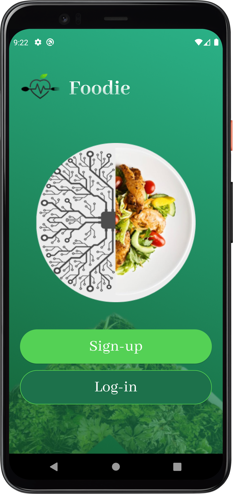
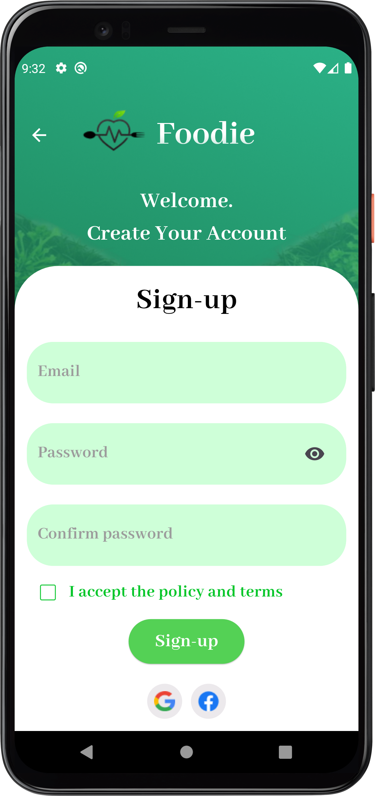

# Foodie App

## Description
The Foodie App is a mobile application built using Flutter that allows users to create an account, add their personal information (age, gender, height, weight, and diseases), and upload food images to scan and analyze the food elements. The app uses the YOLOv8 machine learning model to identify the food items in the uploaded images and calculates the calories, carbs, fat, and protein for each food item. The app connects to the YOLOv8 model through a FastAPI backend. The app also provides a summary of the user's overall nutrition.

# Features
1. User Registration and Profile: Users can create an account and add their personal information, including age, gender, height, weight, and any diseases.
2. Food Scanning: Users can upload images of food items, and the app will use the YOLOv8 machine learning model to identify the food elements. The app will then calculate the calories, carbs, fat, and protein for each food item.
3. Nutrition Summary: The app will provide a summary of the user's overall nutrition, including the total calories, carbs, fat, and protein consumed.
4. Chatbot: The app includes a chatbot feature called Gemini, which can assist users with various tasks using the Gemini API.
5. Food Calculation by Text: Users can also enter food items by text, and the app will calculate the nutrition information for those items.
6. Logout and Edit Profile: Users can log out of the app and edit their personal information as needed.

## Technologies Used
- Flutter
- Dart
- provider (for state management)
- Firebase (for user authentication and database)
- FastAPI (for connecting to the YOLOv8 machine learning model)
- YOLOv8 (for image recognition and food element analysis)
- Gemini API (for the chatbot feature)

## Screenshots
       

     

       

## Contact
If you have any questions or feedback, please feel free to reach out to the project maintainers:
- Ahmed Mohsen : ahmedmohsen2492@gmail.com
